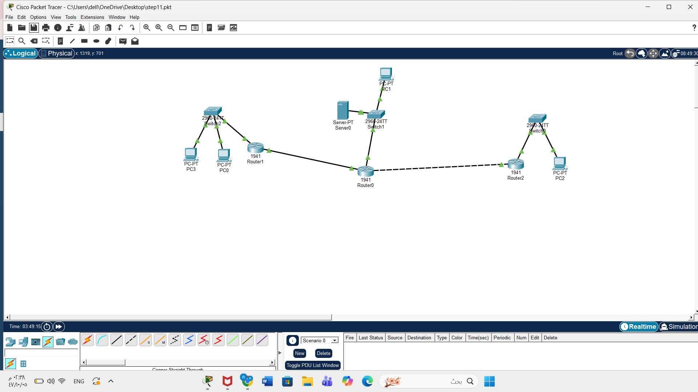
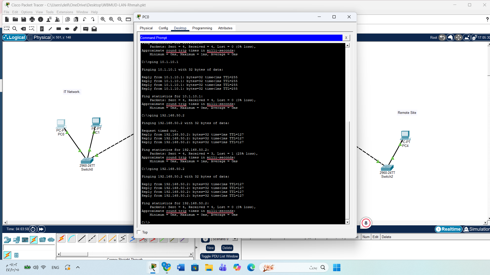
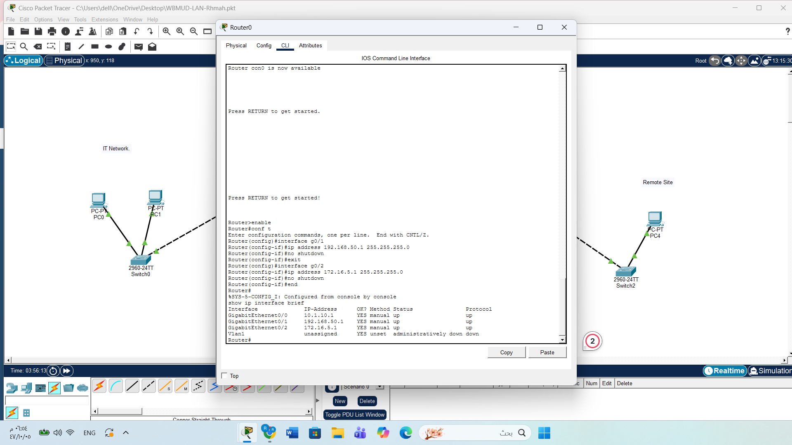

# Lab-04-Enterprise-LAN-Security
# Lab 04 - Enterprise LAN Security

## Network Design
I created a three-tier network that includes IT, OT, and a Remote Pump environment. Each segment is separated to improve security and control traffic.

## Devices Used
- Routers
- Switches
- PCs
- IoT/OT devices

## Security Measures
- Network segmentation between IT, OT, and Remote Pump
- Firewall rules to control access
- Use of HTTPS for secure communication
- Restricted access between network segments

## Implementation Steps
1. Built the network topology in Cisco Packet Tracer
2. Assigned IP addresses to all devices
3. Configured connections between routers and switches
4. Tested connectivity between devices
5. Applied security configurations

## Proof of Work

